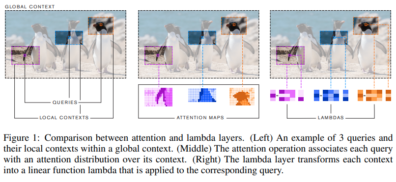

</img>

## Lambda Networks - Pytorch

Implementation of λ Networks, a new approach to image recognition that reaches SOTA on ImageNet. The new method utilizes λ layer, which captures interactions by transforming contexts into linear functions, termed lambdas, and applying these linear functions to each input separately.

<a href="https://www.youtube.com/watch?v=3qxJ2WD8p4w">Yannic Kilcher's paper review</a>

## Install

```bash
$ pip install lambda-networks
```

## Usage

Global context

```python
import torch
from lambda_networks import LambdaLayer

layer = LambdaLayer(
    dim = 32,       # channels going in
    dim_out = 32,   # channels out
    n = 64,         # size of the receptive window - max(height, width)
    dim_k = 16,     # key dimension
    heads = 4,      # number of heads, for multi-query
    dim_u = 1       # 'intra-depth' dimension
)

x = torch.randn(1, 32, 64, 64)
layer(x) # (1, 32, 64, 64)
```

Localized context

```python
import torch
from lambda_networks import LambdaLayer

layer = LambdaLayer(
    dim = 32,
    dim_out = 32,
    r = 23,         # the receptive field for relative positional encoding (23 x 23)
    dim_k = 16,
    heads = 4,
    dim_u = 4
)

x = torch.randn(1, 32, 64, 64)
layer(x) # (1, 32, 64, 64)
```

For fun, you can also import this as follows

```python
from lambda_networks import λLayer
```

## Tensorflow / Keras version

<a href="https://github.com/shinel94">Shinel94</a> has added a Keras implementation! It won't be officially supported in this repository, so either copy / paste the code under `./lambda_networks/tfkeras.py` or make sure to install `tensorflow` and `keras` before running the following.

```python
import tensorflow as tf
from lambda_networks.tfkeras import LambdaLayer

layer = LambdaLayer(
    dim_out = 32,
    r = 23,
    dim_k = 16,
    heads = 4,
    dim_u = 1
)

x = tf.random.normal((1, 64, 64, 16)) # channel last format
layer(x) # (1, 64, 64, 32)
```

## Citations

```bibtex
@inproceedings{
    anonymous2021lambdanetworks,
    title={LambdaNetworks: Modeling long-range Interactions without Attention},
    author={Anonymous},
    booktitle={Submitted to International Conference on Learning Representations},
    year={2021},
    url={https://openreview.net/forum?id=xTJEN-ggl1b},
    note={under review}
}
```
